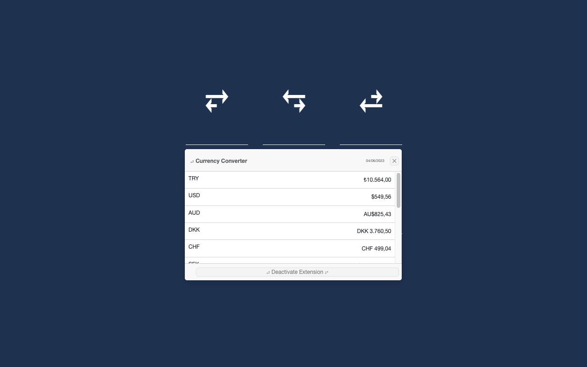

# My Currency Converter Browser Extension

It allows you to convert the prices you choose on the websites to other currencies using daily exchange rates in different currencies.

## Features

- Double-click or select the currency text you want to convert.
- Finds currencies in long texts.
- It only supports conversion from Turkish Lira (TRY) to other currencies.
- Uses "TCMB" daily exchange rates. (Checks every 1 hour cycle and cache it)
- Just click the "Deactivate Extension" button to deactivate the plugin at any time.
- Click the orange button in the lower right corner to activate the plugin again.

## Compatibility

- Chrome (Manifestv3)
- Firefox (Manifestv2)
- Microsoft Edge (Manifestv3)

## Installation

### Chrome Store/Firefox Add-Ons

Go to [My Currency Converter](https://chrome.google.com/webstore/detail/fpkokkdkdhhpcofhplgkhmmiecemfidb) Chrome Store Page

Go to [My Currency Converter](https://addons.mozilla.org/en-US/firefox/addon/my-currency-converter/) Firefox Add-Ons Page

### Local Development

- Run `./build.<env>.sh <NEW_VERSION>` (./build.dev.sh 1.0.0) command after go to "build" folder.

1. Open Chrome and go to: chrome://extensions/
2. Enable: "Developer mode"
3. Click: "Load unpacked extension"
4. Select: "extension" directory
5. Ready to use
6. Go to any website

### Usage

- Double click or select any text

## Licence

See LICENSE for more details.

## Thanks

[Toptal HTML Arrows](https://www.toptal.com/designers/htmlarrows/arrows/) for icon

[Photopea](https://www.photopea.com) for create logo, icon and favicon

## Source

[Firefox Manifest Docs](https://developer.mozilla.org/en-US/docs/Mozilla/Add-ons/WebExtensions/manifest.json) * perfect docs

[Google Chrome Manifest Docs](https://developer.chrome.com/docs/extensions/mv3/manifest/) * not recomended **sorry**

[Microsoft Edge Manifest Docs](https://learn.microsoft.com/en-us/microsoft-edge/extensions-chromium/getting-started/manifest-format) * firefox alternate